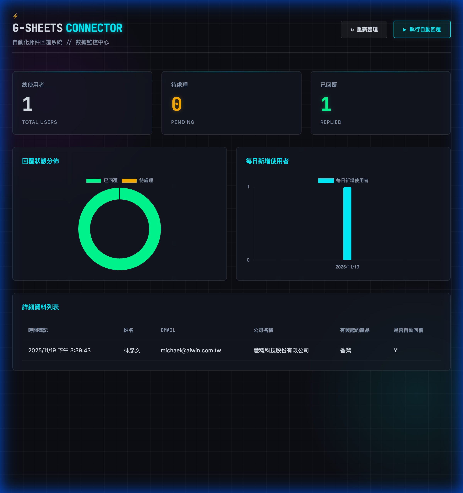

# Google Sheets Email Connector



一個整合 Google Sheets 的自動化郵件回覆系統，具備科技感數據儀表板。
A Google Sheets integrated automated email response system with a tech-themed dashboard.

## ✨ 功能特色 (Features)

- **科技感儀表板 (Tech Dashboard)**: Cyberpunk 風格介面，即時監控數據。
- **自動化回覆 (Auto-Reply)**: 一鍵讀取試算表，自動發送客製化 Email 給未回覆的使用者。
- **狀態同步 (Sync Status)**: 發送完成後自動在試算表中標記 'Y'。
- **數據視覺化 (Analytics)**:
    - **圓餅圖**: 回覆狀態分佈。
    - **長條圖**: 每日新增使用者趨勢（自動讀取日期欄位）。
- **安全設計**: 自動處理 Email 密碼空格，支援 `.env` 環境變數。

## 🚀 快速開始 (Quick Start)

### 1. 安裝依賴 (Install Dependencies)

```bash
npm install
```

### 2. 設定憑證 (Setup Credentials)

請參考 [SETUP.md](SETUP.md) 獲取詳細設定指南。

你需要：
1.  `credentials.json`: Google Cloud Service Account Key (放入專案根目錄)。
2.  `.env`: 設定環境變數 (參考 `.env.example`)。

```ini
EMAIL_USER=your_email@gmail.com
EMAIL_PASS=your_app_password
SPREADSHEET_ID=your_spreadsheet_id
GOOGLE_APPLICATION_CREDENTIALS=./credentials.json
PORT=3000
```

### 3. 啟動專案 (Run Project)

```bash
node server.js
```

打開瀏覽器訪問 `http://localhost:3000`。

## 🛠️ 技術堆疊 (Tech Stack)

- **Frontend**: HTML5, CSS3 (Glassmorphism), Vanilla JS, Chart.js
- **Backend**: Node.js, Express
- **Integrations**: Google Sheets API (googleapis), Nodemailer

## 📝 版本紀錄 (Changelog)

### v1.0.0
- 初始發布
- 實作 Google Sheets 讀寫功能
- 實作 Nodemailer 郵件發送
- 新增科技感儀表板與數據圖表

## 📄 License

ISC
